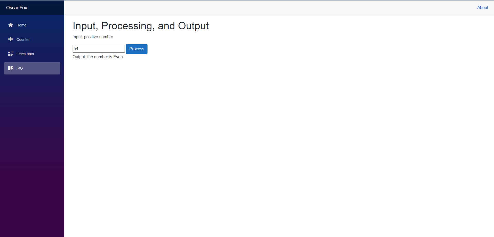

# MyBlazorWebApp
This is my Blazor web application for COP 3003.  

Url to project https://polite-stone-0ff3ecc10.azurestaticapps.net/  

## Tutorials used to build application

First Blazor app - https://dotnet.microsoft.com/learn/aspnet/blazor-tutorial/intro  
Run web app on Azure - https://devblogs.microsoft.com/aspnet/azure-static-web-apps-with-blazor  
Blazor todo list - https://docs.microsoft.com/en-us/aspnet/core/tutorials/build-a-blazor-app?view=aspnetcore-5.0&pivots=server  
 

